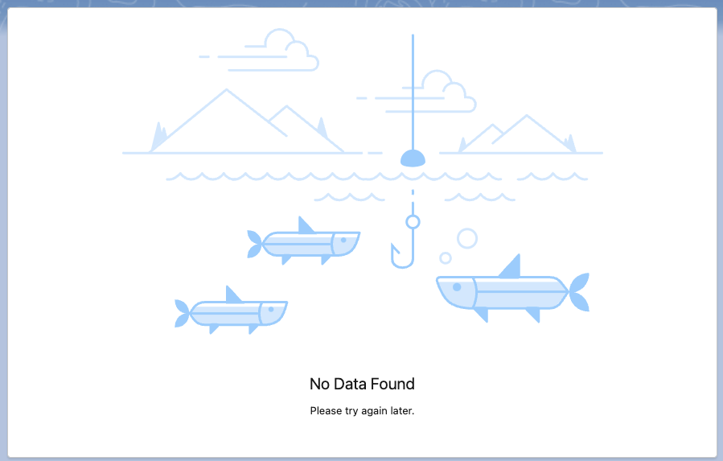
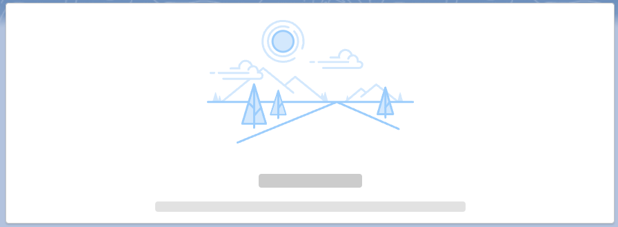

# Lightning Illustration

The `illustration` component is a LWC that displays a visual representation to convey a message. It can be used to display a message when there is no data to display, or when there is an error.

The repository was inspired by the [Lightning Stencil](https://github.com/cesarParra/lightning-stencil) repository created by [@cesarParra](https://github.com/cesarParra).

## Usage

To use the "Illustration" component, you can add it to your html of your own component. All component attributes are optional. Here are the available attributes that can be used to configure the component:

- `size`: the size of the illustration to render. Possible values are `small` or `large`.
- `message-heading`: the heading of the message to be displayed.
- `message-body`: the body of the message to be displayed.
- `illustration`: the name of the illustration to be displayed. This can be a custom image or one of the built-in Salesforce images.

### Example

Here's an example of how to use the "Illustration" component:

```html
<c-illustration
  size="large"
  message-heading="No Data Found"
  message-body="Please try again later."
  illustration="Dessert"
></c-illustration>
```

This will render the "No Data Found" illustration with a large size and the message "Please try again later."



### Example with Lightning Stencil

Example of how to use the "Illustration" component with the [Lightning Stencil](https://github.com/cesarParra) component. \
See repo for more information on how to use the Lightning Stencil component.

```html
<template>
  <lightning-card>
    <c-illustration illustration="Open Road"></c-illustration>
    <lightning-layout multiple-rows>
      <lightning-layout-item size="12" padding="around-small">
        <c-stencil
          class="slds-align_absolute-center"
          weight-variant="dark"
          width="150"
          height="20"
        ></c-stencil>
      </lightning-layout-item>
      <lightning-layout-item size="12" padding="bottom-small">
        <c-stencil
          class="slds-align_absolute-center"
          weight-variant="medium"
          width="450"
          height="15"
        ></c-stencil>
      </lightning-layout-item>
    </lightning-layout>
  </lightning-card>
</template>
```



## Built-in Illustrations

The "Illustration" component comes with several built-in Salesforce images that can be used to convey different types of messages. The illustrations are taken from the [Lightning Design System](https://www.lightningdesignsystem.com/components/illustration/#site-main-content). Here's a list of the available built-in images:

- Custom
  - `FISHING_DEALS`
  - `LAKE_MOUNTAIN`
  - `NO_EVENTS`
  - `NO_TASK`
  - `SETUP`
- Error
  - `NO_ACCESS`
  - `NO_CONNECTION`
  - `NOT_AVAILABLE_IN_LIGHTNING`
  - `PAGE_NOT_AVAILABLE`
  - `WALKTHROUGH_NOT_AVAILABLE`
- Informational
  - `GOING_CAMPING`
  - `MAINTENANCE`
- Miscellaneous
  - `GONE_FISHING`
  - `NO_ACCESS2`
  - `NO_CONTENT`
  - `NO_PREVIEW`
  - `PREVIEW`
  - `RESEARCH`
- No Data
  - `DESSERT`
  - `OPEN_ROAD`

To use any of these built-in images, set the `illustration` attribute to the name of the image. For example, to use the `No Access` image, set the `illustration` attribute to `"NO_ACCESS"`.
